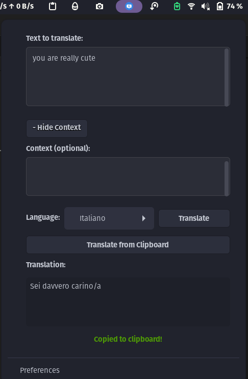

# GTranslator - GNOME Shell Extension

**GTranslator** is a GNOME Shell extension that adds an icon to the top bar (panel) and allows you to translate text using the Google Gemini API. The extension automatically copies the translated text to your clipboard for easy use.


*(Screenshot will be added later)*

## Features

- ✅ **Direct translation from the top bar**: Quick and easy access from the GNOME panel
- ✅ **Google Gemini API support**: Uses the powerful Google Gemini 1.5 Flash translation model
- ✅ **Context-aware translation**: Option to add context to improve translation quality
- ✅ **Clipboard translation**: "Translate from Clipboard" feature to translate already copied text
- ✅ **Image text recognition**: Extract and translate text from images in the clipboard
- ✅ **Auto-copy**: Automatically copies translated text to the clipboard
- ✅ **Multi-language support**: Translation between multiple languages
- ✅ **Intuitive interface**: Simple and functional design

## Requirements

- GNOME Shell 42 or later
- A Google account with access to Google Gemini API (flash model suggested)
- A Google Gemini API key
- XClip (for image clipboard support): `sudo apt install xclip` on Debian/Ubuntu-based systems

## Installation

### Method 1: Using the installation script (recommended)

1. Clone this repository or download the source code:
   ```bash
   git clone https://github.com/Griguoli09/gnome-shell-gtranslator-extension.git
   cd gtranslator
   ```

2. Run the installation script:
   ```bash
   ./install.sh
   ```

3. Restart GNOME Shell:
   - On X11: press `Alt+F2`, type `r` and press Enter
   - On Wayland: log out and log back in

4. Enable the extension using the GNOME Extensions app or GNOME Tweaks

### Method 2: Manual installation

1. Clone this repository or download the source code
2. Copy the `gtranslator@example.com` folder to `~/.local/share/gnome-shell/extensions/`
3. Copy the `gtranslator@example.com/schemas/org.gnome.shell.extensions.gtranslator.gschema.xml` file to `~/.local/share/glib-2.0/schemas/`
4. Compile the schemas with:
   ```bash
   glib-compile-schemas ~/.local/share/glib-2.0/schemas/
   ```
5. Restart GNOME Shell and enable the extension

## Configuration

Before using the extension, you need to configure:

1. Get a Gemini API key:
   - Visit [Google AI Studio](https://makersuite.google.com/app/apikey)
   - Create a new project (if necessary)
   - Generate a new API key

2. Configure the extension:
   - Click the GTranslator icon in the top bar
   - Select "Preferences" from the menu
   - Enter your API key in the appropriate field
   - Select the default target language

## Usage

### Text Translation
1. Click on the GTranslator icon in the GNOME top bar
2. Enter or paste the text to translate in the input field
3. (Optional) Add context by clicking on "+ Add Context"
4. Select the target language from the dropdown menu
5. Click "Translate" or "Translate from Clipboard"
6. The translated text will be displayed and automatically copied to the clipboard

### Image Translation
1. Copy an image containing text to your clipboard (screenshot or image file)
2. Click on the GTranslator icon in the GNOME top bar
3. Click "Translate from Clipboard"
4. The extension will extract text from the image using OCR
5. The extracted text will automatically be translated to your selected language
6. Both the extracted text and its translation will be available in the extension interface

## Uninstallation

To completely remove the extension, run:

```bash
./install.sh --uninstall
```

or manually:

```bash
rm -rf ~/.local/share/gnome-shell/extensions/gtranslator@example.com
rm ~/.local/share/glib-2.0/schemas/org.gnome.shell.extensions.gtranslator.gschema.xml
glib-compile-schemas ~/.local/share/glib-2.0/schemas/
```

## Troubleshooting

### The extension doesn't appear after installation
- Make sure you've restarted GNOME Shell
- Check the extension status with `gnome-extensions list`
- Enable the extension with `gnome-extensions enable gtranslator@example.com`

### "API key not configured" error
- Go to the extension preferences and enter your Google Gemini API key

### "No image found in clipboard" error
- Make sure you have XClip installed: `sudo apt install xclip`
- Verify you have actually copied an image to your clipboard
- Try copying the image again

### Translation or API call errors
- Verify that your API key is correct and active
- Check your internet connection
- Verify the Gemini API quota limits

### Error logs
If the extension doesn't work correctly, you can check the logs with:
```bash
journalctl -f -o cat /usr/bin/gnome-shell | grep gtranslator
```

## Development

To contribute to the project:

1. Fork the repository
2. Create a branch for your changes
3. Open a Pull Request with your changes

## License

This project is released under the MIT License. See the `LICENSE` file for details.

---

© 2025 GTranslator
